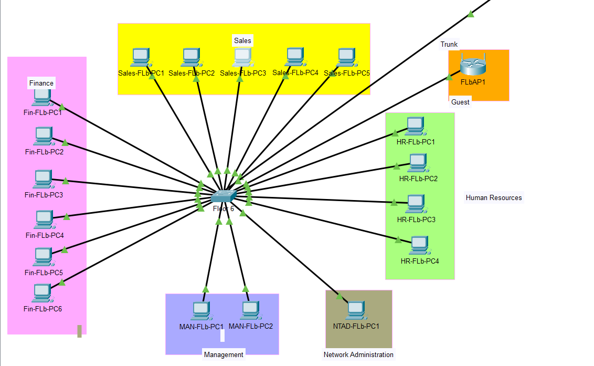
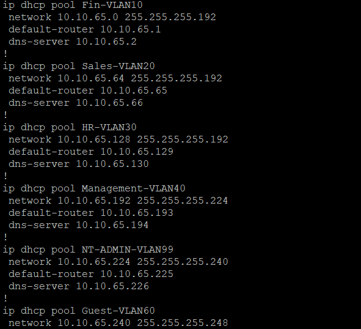
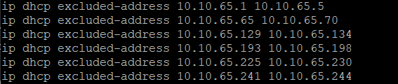

# 📦 DHCP Server Configuration Lab

In this lab, I configured **DHCP pools** for different VLANs, created **excluded address ranges** for critical services like printers and gateways, and assigned proper DNS and default routers for each subnet.

---

## ✅ Objective
- Configure DHCP pools for various VLANs
- Exclude critical IP ranges for static devices
- Set default gateways and DNS for each VLAN

---

## Network Breakdown

Each VLAN was configured with its own DHCP pool. Excluded address ranges were reserved for gateways, printers, and servers to avoid IP conflicts. The pools are as follows:

- **VLAN 10 (Finance):** 10.10.65.0/26
- **VLAN 20 (Sales):** 10.10.65.64/26
- **VLAN 30 (HR):** 10.10.65.128/26
- **VLAN 40 (Management):** 10.10.65.192/29
- **VLAN 99 (Network Admin):** 10.10.65.224/29
- **VLAN 60 (Guest):** 10.10.65.240/29

### 🖥️ Topology Diagram

This diagram illustrates the device layout per VLAN and their connection to the central switch on Floor 6B.

---

## ⚙️ DHCP Pools Configuration

---

## 🖼️ Excluded Address Ranges

