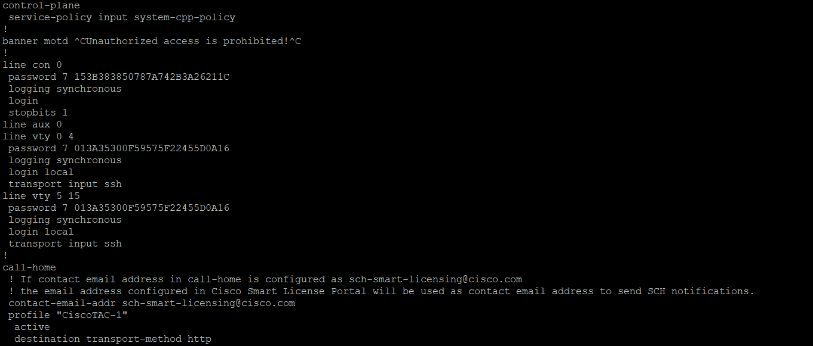

# Cisco Networking Lab

## 🔐 SSH Setup

In this setup, I configured **SSH** on my network devices to allow secure remote access. Below are the steps I followed, along with some basic configurations.

### ✅ Objective

- Enable SSH access on the switch/router
- Set hostname and domain name
- Generate RSA keys
- Create a user account
- Configure VTY lines for SSH only

---

### ⚙️ Configuration Steps

Switch>enable

Switch#configure terminal

synchronizes unsolicited messages and debug output with solicited user input and prompts

logging synchronous 

! Set the banner for unauthorized access

Switch(config)# banner motd #Unauthorized access is prohibited!#

! Set hostname and domain name

Switch(config)# hostname SWFloor6b

SWFloor6b(config)# ip domain-name ist4210-Lab.com

! Generate RSA key for SSH

SWFloor6b(config)# crypto key generate rsa

How many bits in the modulus [512]: 1024

! Create a local user

SWFloor6b(config)# username sshadmin secret sshadmin

! Configure the console line
SWFloor6b(config)# line con 0

SWFloor6b(config-line)# password YOURPASSWORD

SWFloor6b(config-line)# login

SWFloor6b(config-line)# exit

! Configure VTY lines for SSH
SWFloor6b(config)# line vty 0 4

SWFloor6b(config-line)# transport input ssh

SWFloor6b(config-line)# login local

SWFloor6b(config-line)# exit

! Enable SSH Version 2
SWFloor6b(config)# ip ssh version 2

