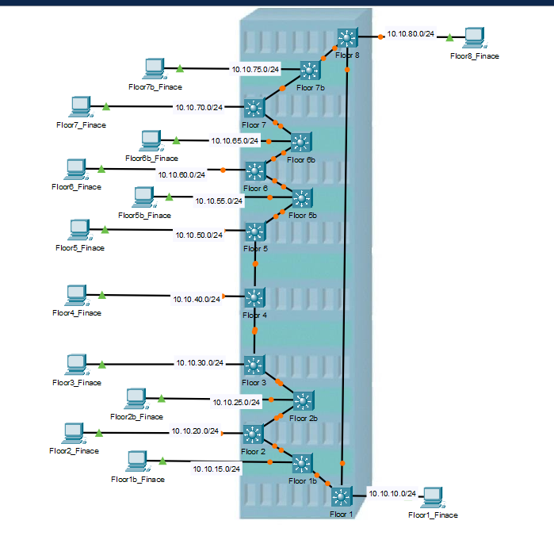
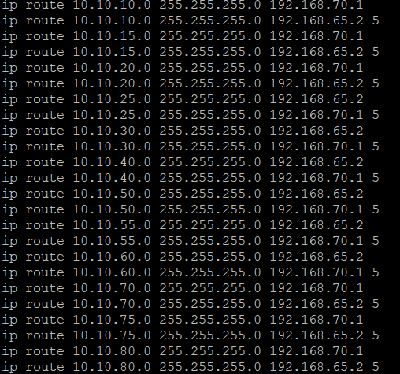

# 🛣️ Static Routing with Redundancy Lab

In this lab, I configured **static routes** for a network with 8 floors. Each floor has a primary and a secondary route to ensure redundancy in case of gateway failure.

---

## ✅ Objective

- Set up static routes for each floor
- Implement a primary and backup route
- Use `ip route` to simulate failover routing

---

## 🧱 Network Design

- Floors: 8 (Each on different subnets)
- Redundancy: Primary and backup gateways per subnet
- Routing Logic:

  - Upstream (Floor 6B and above):

  - 192.168.70.1 – Primary route

  - 192.168.65.2 – Secondary/backup route

  - Downstream (Floor 6B and below):

  - 192.168.65.2 – Primary route

  - 192.168.70.1 – Secondary/backup route

---

##  🗺️ Topology

## ⚙️ Configuration

Below is the  upstream static routing configuration used in this lab, including primary and backup routes for all 8 floors:

## 📝 Notes

- I was assigned **Floor 6B**, so I configured static routes **upstream and downstream** starting from my floor.
- For my configuration, the **primary gateway** was `192.168.70.1`, and the **backup** was `192.168.65.2` for upstream routing.
- I **no longer have access to the switch**, so I couldn’t document the downstream configuration (where the backup became primary and vice versa).
